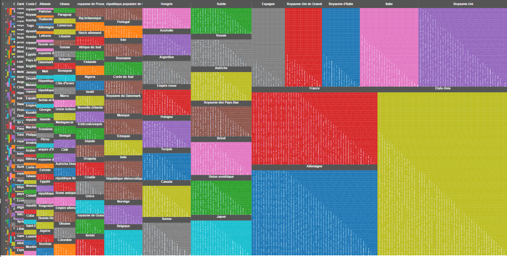
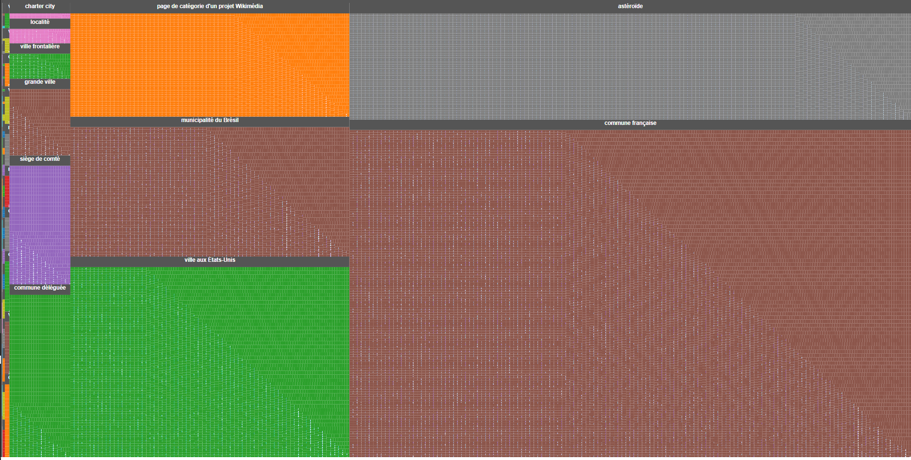
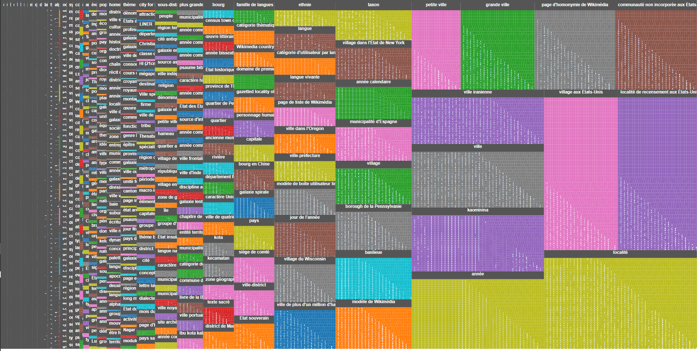

# wiki-mg
Creation of a text corpus from the Malagasy Wikipedia

## script.py
Script to extract metadata about pages from the Malagasy Wikipedia, taking as input a dump of this Wikipedia:
1. download file https://dumps.wikimedia.org/mgwiki/latest/mgwiki-latest-pages-articles.xml.bz2 (or another dump accessed from page https://dumps.wikimedia.org/mgwiki/latest/)
2. extract the file mgwiki-latest-pages-articles.xml contained in it and put it in the same folder as script.py
3. run `python script.py` which outputs a file named `pages.csv` with metadata about the pages (title in the first column, size in bytes in the second column)

## pages.csv
An example of output file of the script `script.py`, obtained on 2023-10-06

## PagesWikipediaEnMalgache.xlsx
An Excel file obtained from pages.csv by trying to filter some pages which are not relevant to get "real" texts in Malagasy:
* columns E to I detect if the page title shows that it is a special page, not from the main space of Wikipedia
* column J detects if the file seems too small to contain an interesting text
* column K provides a reason for excluding the page, which was added manually, but sometimes to entire blocks of consecutive pages (may include wrong labels for pages which should have been kept)
* column L provides a direct link (generated from the page title)
* column M provides a (very, absurdly) rough estimation of the number of words corresponding to the text size
* column N provides this value only for pages which seem relevant to keep (therefore, there is a filter on this column)

## Requêtes Wikidata listant les éléments Wikidata associés à une page Wikipédia en malgache
Les images ci-dessous correspondent aux résultats des requêtes le 26/10/2023
### Êtres humains
http://w.wiki/7uni (35625 éléments) :

### Éléments wikidata hors êtres humains avec les natures les plus fréquentes
http://w.wiki/7unb (45703 éléments) :

### Éléments wikidata hors êtres humains, communes françaises, astéroïdes, villes aux États-Unis, municipalités du Brésil et pages de catégorie d'un projet Wikimédia avec les natures les plus fréquentes
http://w.wiki/7unQ (34977 éléments) :

